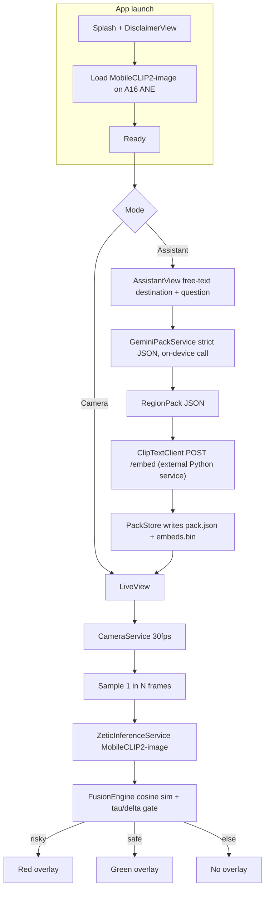

# Campy / ZeticMelangeVibe — PRD and Implementation Plan

Single-screen SwiftUI iOS app that uses Gemini for online region-pack generation and Zetic-hosted MobileCLIP2 for offline real-time camera labeling of foraging risks. Risky pack entries draw red, confident benign matches draw green, everything else stays blank.

Target device: **iPhone 15** (A16 Bionic, 16-core ANE).

## Implementation guidelines

- **Source of truth for Apple frameworks is the official Apple Developer Documentation.** During implementation, consult docs (via the `user-apple-docs` MCP) before writing non-trivial framework code. Don't rely on memory for API surfaces. Specifically expected references:
  - `AVFoundation` for `AVCaptureSession`, `AVCaptureVideoDataOutput`, `AVCaptureDevice`, sample-buffer handling, threading rules.
  - `CoreVideo` for `CVPixelBuffer` formats and pixel-buffer pool patterns.
  - `SwiftUI` for `@Observable`, `@Environment`, sheet/transition animations, safe-area insets (Dynamic Island handling).
  - `UIKit`/`SwiftUI` interop for `UIViewRepresentable` (camera preview layer).
  - `Foundation` for `URLSession`, `JSONEncoder`/`JSONDecoder` with strict keys, `FileManager` (`.applicationSupportDirectory`).
  - `Accelerate`/`vDSP` if vectorized cosine similarity is needed (likely yes for the fusion engine).
- Cite the doc URL in code comments only when the API has non-obvious constraints (e.g., `AVCaptureSession` start/stop must be on a background queue).
- ZeticMLange-specific calls follow `https://docs.zetic.ai/` rather than Apple docs; Apple docs cover everything else.

## Locked architecture decisions

- **Shell**: Single SwiftUI root with state-driven mode switching (camera vs assistant). `AVCaptureSession` is paused but not torn down on assistant mode.
- **Recognition**: MobileCLIP2 zero-shot.
  - **Image encoder**: Zetic-hosted `Steve/MobileCLIP2-image` v1 loaded via `ZeticMLangeModel`, runs on A16 ANE per frame, 256x256 input, 512-dim output.
  - **Text encoder**: NOT available on Zetic Melange dashboard (no `Steve/MobileCLIP2-text` exists). Instead, a tiny external Python service (FastAPI on Modal or HF Spaces, ~30 LOC) hosts `open_clip.create_model_and_transforms('MobileCLIP2-S{X}', pretrained='dfndr2b')` and exposes one POST endpoint that maps `[String] -> [[Float]]` of 512-dim embeddings. Called **exactly once per pack** by iOS during pack generation. Variant must match the Zetic image encoder (S0 most likely; verified in todo 1).
- **Online prep**: iOS calls Gemini directly (`gemini-2.5-flash` with `responseSchema` JSON mode + `responseMimeType: application/json`). API key surfaced from `Secrets.xcconfig` -> Info.plist -> `SecretsLoader`; never committed. **Single-shot**: one Gemini call per destination produces the entire pack plus a textual prep blurb. No multi-turn chat.
- **Pack contents per region**: `risky_entries[]` and `safe_entries[]` (each with `label`, `aliases[]`, `prompt_template`, `severity`, `rationale`), plus auto-injected `negative_anchors[]` ("a photo of forest floor", "a photo of leaves", "a photo of bare ground") to absorb uncertain frames.
- **Fusion rule (hard gate, no score arithmetic with text)**:
  - For each frame: image embedding . text-embedding-matrix -> similarities.
  - Pick `top1`. Require `top1_sim >= tau` AND `top1_sim - top2_sim >= delta`. If `top1` is a negative anchor, draw nothing.
  - If `top1` is in `risky_entries` -> red overlay with rationale.
  - If `top1` is in `safe_entries` -> green overlay with label only (no "safe to eat" copy ever).
  - Otherwise -> no overlay.
- **Region input**: free-text. Rehearse with a specific destination ("Angeles National Forest") for the demo.
- **Labeling policy**: red+green, but green never says "safe to eat" — only "identified as: …".
- **Disclaimer**: one-time launch sheet (must accept) + persistent small footer in camera mode. Copy avoids "exhaustive" / survival-grade framing.
- **Performance targets (iPhone 15 / A16)**: 30 fps preview, 10-15 Hz MobileCLIP2-image inference on ANE (zeticai benchmarks suggest ~10ms/frame on top NPUs, A16 likely ~5-15ms), <300 ms label-to-screen, <2 s mode-switch, <3 s one-time text-embedding fetch for a typical pack (~50 entries x aliases plus negative anchors).
- **Persistence**: pack JSON + binary text-embedding blob in `Application Support/RegionPacks/{slug}/`. Manual refresh; auto-flag stale after 14 days but don't block use.
- **Demo safety net**: bundle one pre-generated pack for the rehearsed destination so airplane-mode failure of online prep doesn't kill the demo.

## Locked defaults (small decisions, baked in)

- **Build target**: iPhone 15 only. `IPHONEOS_DEPLOYMENT_TARGET = 17.0`, `TARGETED_DEVICE_FAMILY = 1` (iPhone), portrait-only. Hardware assumptions: A16 Bionic with 16-core Neural Engine (~17 TOPS), 6 GB RAM, 6.1" Super Retina XDR (2556x1179), Dynamic Island, 48MP rear wide camera. We don't need to gate the App Store binary to one model, but we test, tune thresholds, and benchmark exclusively on iPhone 15.
- **Concurrency**: Swift Concurrency end-to-end (`async/await`, `actor`). No Combine.
- **Camera**: rear lens, 1920x1080 preset, 30 fps preview, `kCVPixelFormatType_32BGRA` sample format.
- **Inference threading**: capture queue dispatches frames to a dedicated `actor InferenceWorker`. If a previous frame is still in flight, drop the new one (no queueing, no head-of-line blocking).
- **Pack conflict rule**: if a label appears in both `risky_entries` and `safe_entries`, risky wins; safe duplicate is dropped at parse time.
- **Pack overwrite**: keyed by destination slug (lowercased + ASCII-folded). Re-generation overwrites on disk, last-write-wins.
- **Pack TTL**: 14 days soft-stale (UI prompts regenerate); never hard-blocks usage.
- **Permission denial**: `CameraDeniedView` with "Open Settings" deep link replaces `LiveView` when authorization is `.denied`/`.restricted`.
- **Localization**: English-only for MVP; all copy in `UIStrings.swift` so localization is a future lift, not a refactor.
- **Light/dark**: system-driven, with chip palettes tuned for both.
- **Dynamic Island**: do not draw `OverlayCanvas` content under the island region; reserve top safe-area inset accordingly (iPhone 15 has Dynamic Island, not a notch).
- **Red label content**: label name + max-2-line rationale. Tap-to-expand sheet for full rationale.
- **Telemetry**: none external. Local-only debug HUD.

## Data flow



## Module layout

Single Xcode target with strict folder boundaries. Services exposed as **protocols**; concrete types live in `Services/`. Views depend on protocols only. No singletons. A single `AppContainer` is built in `ZeticMelangeVibeApp.swift` and propagated via `@Environment(\.appContainer)`.

All paths under `ios/ZeticMelangeVibe/`.

- `ZeticMelangeVibeApp.swift` — `@main`; constructs `AppContainer`, hands it to `ContentView`.
- `Info.plist` — `NSCameraUsageDescription`, ATS allowing Gemini host. References `$(GEMINI_API_KEY)` from xcconfig.
- `Config/` (centralized configuration, edit here to tune behavior)
  - `AppConfig.swift` — runtime tunables: `tau`, `delta`, `frameStrideHz`, `inferenceTimeoutMs`, `packTTLDays`, performance targets. All `static let`, single source of truth.
  - `ModelConfig.swift` — Zetic image-encoder identifier (`Steve/MobileCLIP2-image`), version (`1`), `modelMode: .RUN_AUTO`, input size (`256x256`), normalization mean/std (OpenCLIP defaults — verify in spike), embedding dimension (`512`), text-embedding endpoint URL, MobileCLIP2 variant identifier (e.g., `MobileCLIP2-S0`).
  - `PromptConfig.swift` — Gemini system-prompt template, JSON schema (`responseSchema`), fixed `negativeAnchors: [String]`, prompt-template format string for entries (e.g. `"a photo of a {label}"`).
  - `UIConfig.swift` — color tokens (light/dark), spacing scale, animation durations, chip styling.
  - `UIStrings.swift` — every user-facing string in one file (disclaimer copy, CTAs, error strings, footer text).
  - `Secrets.xcconfig` (gitignored) — `GEMINI_API_KEY`, `ZETIC_PERSONAL_KEY` (dev key: `dev_d39395a6f24f481db0624aedc758ce47`), `CLIP_TEXT_ENDPOINT_URL`. Surfaced via Info.plist build settings.
  - `SecretsLoader.swift` — reads keys from `Bundle.main.infoDictionary` at startup; fatal-error fast on missing keys.
- `Composition/`
  - `AppContainer.swift` — owns and wires every service; built once at app start; passed via `@Environment`. Exposes protocols, not concrete types.
  - `EnvironmentKeys.swift` — `AppContainerKey` and `EnvironmentValues.appContainer` accessor.
- `Domain/` (pure value types, no UIKit/AVFoundation imports)
  - `RegionPack.swift` — `Codable` schema: `schemaVersion`, `destinationSlug`, `generatedAt`, `riskyEntries[]`, `safeEntries[]`, `prepBlurb`. Each `Entry`: `label`, `aliases[]`, `promptTemplate`, `severity`, `rationale`.
  - `PackEmbeddings.swift` — typed wrapper around the float matrix + alignment with pack entry indices and negative anchors.
  - `DetectionState.swift` — `enum DetectionState { case blank, risky(Entry, Float), safe(Entry, Float) }`.
  - `ModelInputSpec.swift` — preprocessing record (size, mean, std) sourced from `ModelConfig`.
- `Services/` (concrete implementations behind protocols defined alongside)
  - `CameraServiceProtocol.swift` + `CameraService.swift` — `AVCaptureSession`, sample-buffer delegate, frame stride, `pause()`/`resume()`.
  - `TensorFactoryProtocol.swift` + `ZeticTensorFactory.swift` — `CVPixelBuffer` -> normalized tensor.
  - `InferenceServiceProtocol.swift` + `ZeticInferenceService.swift` — wraps the Zetic `ZeticMLangeModel` for `Steve/MobileCLIP2-image`; `actor`-based; method `encodeImage(buffer) -> [Float]` returning a 512-dim L2-normalized vector.
  - `GeminiServiceProtocol.swift` + `GeminiPackService.swift` — strict-JSON Gemini call, schema validation, single retry on parse failure.
  - `ClipTextClientProtocol.swift` + `ClipTextClient.swift` — `URLSession`-based HTTP client for the external CLIP text-embedding endpoint; one POST per pack with all entry/alias/anchor strings; returns aligned 512-dim vectors. L2-normalizes server-side or client-side (locked in protocol).
  - `PackEmbeddingService.swift` — orchestrates the one-shot text-embedding fetch on pack arrival via `ClipTextClient`; returns `PackEmbeddings`. Falls back to bundled embeddings if the endpoint is unreachable.
  - `PackStoreProtocol.swift` + `PackStore.swift` — read/write `pack.json` + `embeds.bin` under `Application Support/RegionPacks/{slug}/`; lists packs; selects active; falls back to bundled demo pack on missing/error.
  - `FusionEngineProtocol.swift` + `FusionEngine.swift` — pure function: cosine sim + tau/delta gate + negative-anchor suppression -> `DetectionState`.
  - `InferenceTelemetry.swift` — `@Observable`; running fps + last latency + last `top1/sim/margin` for the debug HUD.
- `Views/`
  - `ContentView.swift` — root; reads `AppContainer` from environment; owns `Mode` state; routes to mode-specific views.
  - `LiveView.swift` — `CameraPreviewView` + `OverlayCanvas` + bottom mode switcher + persistent disclaimer footer.
  - `CameraPreviewView.swift` — `UIViewRepresentable` over `AVCaptureVideoPreviewLayer`.
  - `OverlayCanvas.swift` — centered red/green chip; animated; suppressed on `.blank`; tap-to-expand sheet.
  - `AssistantView.swift` — destination text field + optional question + "Generate pack" CTA + post-generation prep-blurb display + pack contents list.
  - `ModelLoadingView.swift` — splash/progress while CLIP models load.
  - `DisclaimerView.swift` — launch sheet, persists acceptance in `UserDefaults`.
  - `CameraDeniedView.swift` — fallback when camera authorization is denied/restricted; "Open Settings" deep link.
  - `DebugHUDView.swift` — overlay (toggleable) showing fps, last latency, top1/sim/margin.

## External services (sidecar, not a real backend)

A separate folder at the repo root, **not** inside `ios/`:

- `services/clip-text-encoder/`
  - `main.py` — FastAPI app, single endpoint `POST /embed { texts: [String] } -> { embeddings: [[Float]], dim: 512, variant: "MobileCLIP2-S0" }`. Loads `open_clip.create_model_and_transforms(MOBILECLIP2_VARIANT, pretrained='dfndr2b')` once at startup; runs `reparameterize_model`; tokenizes with `open_clip.get_tokenizer(MOBILECLIP2_VARIANT)`; batches and L2-normalizes.
  - `requirements.txt` — `fastapi`, `uvicorn`, `open_clip_torch`, `timm`, `torch`.
  - `modal_app.py` (or equivalent for HF Spaces) — minimal deploy wrapper.
  - `README.md` — deploy instructions, the env var the iOS app needs (`CLIP_TEXT_ENDPOINT_URL`).
  - The variant constant is the **single source of truth for the variant**; the iOS `ModelConfig.mobilecliptVariant` must match this string.

### Why this organization
- Editing tuning numbers never touches business logic — open `Config/AppConfig.swift`.
- Editing prompts or anchor list never touches services — open `Config/PromptConfig.swift`.
- Swapping any service for a mock/test is a one-line change in `AppContainer`.
- `Domain/` has zero framework dependencies, so it could be unit-tested without Xcode test target gymnastics.

## Threshold tuning notes (1-2h block before demo)

- Default starting points: `tau = 0.25`, `delta = 0.04` (CLIP cosine sims of normalized vectors).
- Tune on the actual printed prop. If false positives happen with empty scenes, raise `tau` or expand negative anchors. If real prop misses, lower `delta`.
- Add a debug HUD toggle (`InferenceTelemetry`) that shows `top1 label / sim / margin` to make tuning fast.

## Out of scope for MVP (call out, do not build)

- Bounding boxes (no detector in this pipeline).
- Multi-region pack switching UI beyond a simple list.
- On-device pack generation / on-device vision LLM (`gemma-3n-E2B-it`) "tap to ask" — stretch only.
- Account / sync / sharing.

## Risks and mitigations

- **Variant mismatch between Zetic image encoder and our text encoder.** The most dangerous bug — embeddings from different MobileCLIP2 sizes do not align, so cosine similarity returns near-noise. Mitigation: lock the variant in `services/clip-text-encoder/main.py` and `iOS Config/ModelConfig.swift` to the same string; assert on app start that `embedding_dim == 512` and the variant strings match (server returns its variant, client compares).
- **Image-encoder preprocessing mismatch.** MobileCLIP2 uses OpenCLIP normalization, not the original CLIP `(0.48145466, 0.4578275, 0.40821073)` mean. Verify the exact mean/std from `open_clip`'s `MobileCLIP2-S{X}` config during the first-hour spike and lock in `ModelConfig.swift`.
- **CLIP text endpoint cold start.** Modal/HF Spaces can have multi-second cold starts. Mitigation: warm the endpoint right before the demo; bundled fallback pack ships pre-computed embeddings so the offline demo never depends on this service.
- **Gemini schema drift.** Mitigate with `responseSchema`/JSON-mode + a strict `Codable` decode; on parse failure, retry once with the failure message appended.
- **CLIP confusing the demo prop.** Use a high-quality printed photo of one species the model recognizes well; verify with a 5-minute embedding-distance smoke test before stage time.
- **Demo offline failure.** Bundled fallback pack (Angeles NF) loads via `PackStore` even when both Gemini and the text endpoint are unreachable.
- **ZeticMLangeiOS package version drift.** Pin to **exact** 1.6.0 in Xcode (Dependency Rule -> Exact Version) so a transient SPM update can't break the build mid-hackathon.

## Implementation todos (in execution order)

1. **verify-mobileclip-variant** — First-hour spike: visit `https://mlange.zetic.ai/p/Steve/MobileCLIP2-image` to confirm which MobileCLIP2 variant (S0/S2/B/etc.) is hosted. Smoke test with a tiny iOS scratch app that calls `ZeticMLangeModel(personalKey:..., name: "Steve/MobileCLIP2-image", version: 1)` and runs a 256x256 dummy tensor through it. Record output shape and a few sanity embeddings. Lock the variant constant so the text-encoder service can be configured to match. Also lock the exact OpenCLIP normalization mean/std for that variant.
2. **clip-text-encoder-service** — Build `services/clip-text-encoder/` FastAPI app: load `open_clip MobileCLIP2-S{X}` matching the verified variant, reparameterize, expose `POST /embed`. Deploy on Modal or HF Spaces. Smoke-test from curl. Capture endpoint URL into `Secrets.xcconfig`.
3. **project-setup** — Materialize Xcode project, pin `ZeticMLangeiOS` SPM dependency to **exact** `1.6.0`, `Info.plist` with `NSCameraUsageDescription`, `Secrets.xcconfig` with `GEMINI_API_KEY` + `ZETIC_PERSONAL_KEY` + `CLIP_TEXT_ENDPOINT_URL`, `.gitignore` the secret config. Verify `SecretsLoader` fatal-errors fast on missing keys.
4. **config-and-composition** — Build `Config/` (AppConfig, ModelConfig, PromptConfig, UIConfig, UIStrings, Secrets.xcconfig, SecretsLoader) and `Composition/` (AppContainer, EnvironmentKeys). Establish protocol-based service boundaries before writing any concrete service so wiring is enforced from day one.
5. **domain-types** — Define `Domain/` value types (RegionPack, PackEmbeddings, DetectionState, ModelInputSpec) with no UIKit/AVFoundation imports. Strict `Codable` schema with `schemaVersion`.
6. **camera-pipeline** — Implement `CameraService` (AVCaptureSession, sample-buffer delegate, pause/resume) and `ZeticTensorFactory` (CVPixelBuffer -> normalized tensor using `ModelConfig` constants). Both behind protocols.
7. **inference-service** — Implement `ZeticInferenceService` as an `actor` wrapping the Zetic MobileCLIP2-image model. Single method `encodeImage(buffer) -> [Float]` returning a 512-dim L2-normalized vector. Drop-frame policy: skip new frame if previous is still in flight.
8. **gemini-service** — Implement `GeminiPackService.swift`: strict-JSON prompt, schema validation, single-retry on parse failure. Test with the rehearsed destination.
9. **embedding-and-storage** — Implement `ClipTextClient.swift` (URLSession POST to the `/embed` endpoint), `PackEmbeddingService.swift` (orchestrates one-shot embed fetch on pack arrival; aligns to entry/alias/anchor indices; falls back to bundled embeddings on failure), and `PackStore.swift` (persist + load pack JSON and embedding blob from `Application Support/RegionPacks/{slug}/`).
10. **fusion-engine** — Implement `FusionEngine.swift` as a pure function: cosine similarity, top1+margin gate, negative-anchor suppression. Unit-test the gate logic with synthetic embeddings.
11. **swiftui-shell** — Build `ContentView`, `LiveView` (CameraPreviewView + OverlayCanvas), `AssistantView` (single-shot pack generation + prep-blurb display + pack list), `ModelLoadingView`, `DisclaimerView`, `CameraDeniedView`, `DebugHUDView`. State-driven mode switch, no NavigationStack. All services injected via `@Environment(\.appContainer)`.
12. **overlay-rendering** — `OverlayCanvas`: red/green centered chip with rationale, smooth fade in/out, suppression on blank. Persistent small footer disclaimer.
13. **telemetry-hud** — Implement `InferenceTelemetry` and a debug HUD overlay (toggle via 3-finger tap or hidden settings) showing fps, last latency, top1 label, sim, margin. Required for threshold tuning.
14. **bundled-fallback-pack** — Generate a real pack for the rehearsed demo destination, commit `pack.json` + `embeds.bin` to app bundle, have `PackStore` prefer disk pack but fall back to bundled.
15. **threshold-tuning** — Block 60-90 min on hardware: tune `tau` and `delta` against the printed demo prop; expand negative anchors if needed; lock final values in code.
16. **demo-rehearsal** — End-to-end rehearsal: online prep with destination, full airplane-mode test, force-refresh button, risky lookalike triggers red, ambiguous frame stays blank, benign confident match triggers green.

## Reference: Zetic image-encoder integration

Add the SPM dependency `https://github.com/zetic-ai/ZeticMLangeiOS.git`, pinned to exact version `1.6.0` (Xcode -> Package Dependencies -> ZeticMLangeiOS -> Dependency Rule -> Exact Version).

```swift
// Reads dev_d39395a6f24f481db0624aedc758ce47 from Secrets.xcconfig via SecretsLoader.
let model = try ZeticMLangeModel(
    personalKey: SecretsLoader.zeticPersonalKey,
    name: "Steve/MobileCLIP2-image",
    version: 1,
    modelMode: .RUN_AUTO,
    onDownload: { progress in /* 0.0 to 1.0 */ }
)

let inputs: [Tensor] = [/* 256x256 normalized BGRA -> RGB float tensor */]
let outputs = try model.run(inputs)
// outputs[0] is the 512-dim image embedding; L2-normalize before cosine similarity.
```

## Reference: matching text encoder (Hugging Face)

`https://huggingface.co/timm/MobileCLIP2-S0-OpenCLIP` (or the `S2`/`B`/`S3`/`S4` sibling that matches the verified Zetic variant). This repo cannot be loaded directly into Zetic; it is consumed by the `services/clip-text-encoder/` Python sidecar via:

```python
import open_clip
from timm.utils import reparameterize_model

model, _, _ = open_clip.create_model_and_transforms("MobileCLIP2-S0", pretrained="dfndr2b")
model.eval()
model = reparameterize_model(model)
tokenizer = open_clip.get_tokenizer("MobileCLIP2-S0")
# encode_text -> 512-dim vectors; L2-normalize before returning.
```
