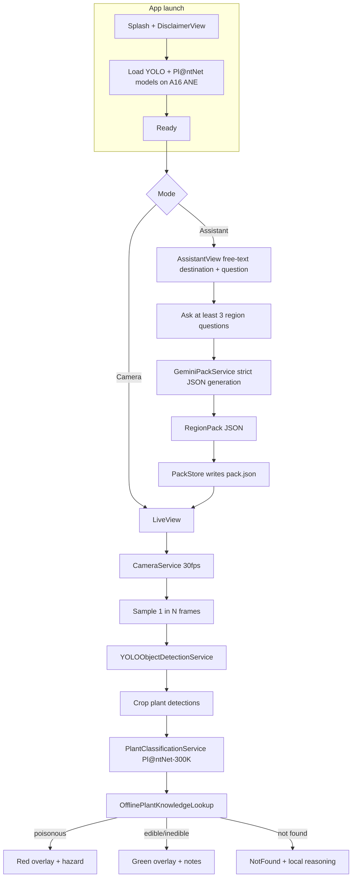

# Campy / ZeticMelangeVibe — PRD and Implementation Plan

Single-screen SwiftUI iOS app that uses Gemini for online region-pack generation and a two-stage YOLO + Pl@ntNet pipeline for offline real-time plant risk labeling. YOLO detects plant objects, each crop is classified by Pl@ntNet-300K, then the app matches the scientific name against a locally stored region JSON to show edible/inedible/poisonous guidance.

Target device: **iPhone 15** (A16 Bionic, 16-core ANE).

## Implementation guidelines

- **Source of truth for Apple frameworks is the official Apple Developer Documentation.** During implementation, consult docs (via the `user-apple-docs` MCP) before writing non-trivial framework code. Don't rely on memory for API surfaces. Specifically expected references:
  - `AVFoundation` for `AVCaptureSession`, `AVCaptureVideoDataOutput`, `AVCaptureDevice`, sample-buffer handling, threading rules.
  - `CoreVideo` for `CVPixelBuffer` formats and pixel-buffer pool patterns.
  - `SwiftUI` for `@Observable`, `@Environment`, sheet/transition animations, safe-area insets (Dynamic Island handling).
  - `UIKit`/`SwiftUI` interop for `UIViewRepresentable` (camera preview layer).
  - `Foundation` for `URLSession`, `JSONEncoder`/`JSONDecoder` with strict keys, `FileManager` (`.applicationSupportDirectory`).
  - `Accelerate`/`vDSP` if vectorized cosine similarity is needed (likely yes for the fusion engine).
- Cite the doc URL in code comments only when the API has non-obvious constraints (e.g., `AVCaptureSession` start/stop must be on a background queue).
- ZeticMLange-specific calls follow `https://docs.zetic.ai/` rather than Apple docs; Apple docs cover everything else.

## Locked architecture decisions

- **Shell**: Single SwiftUI root with state-driven mode switching (camera vs assistant). `AVCaptureSession` is paused but not torn down on assistant mode.
- **Recognition**: YOLO object detection + Pl@ntNet-300K classification.
  - **Detector**: YOLO detects all visible plants in each frame (multi-box inference).
  - **Classifier**: Each detected crop is run through Pl@ntNet-300K to predict a scientific name and confidence.
  - **Runtime**: preferred path is Zetic-hosted models on-device; fallback path is local model loading from repository assets/code if Zetic hosting is not feasible.
- **Online prep**: iOS calls Gemini directly (`gemini-2.5-flash` with `responseSchema` JSON mode + `responseMimeType: application/json`). API key surfaced from `Secrets.xcconfig` -> Info.plist -> `SecretsLoader`; never committed. Before JSON generation, assistant asks at least 3 destination-specific questions. Then one online generation pass produces region JSON plus textual prep blurb.
- **Pack contents per region**: one JSON per destination containing species keyed by scientific name and categorized as `edible`, `inedible`, or `poisonous`, including aliases/common names, risk rationale, and preparation notes (for example, required cooking/handling precautions). Goal is best-effort exhaustive coverage for that region.
- **Offline decision rule**:
  - For each detected plant: classify to `scientific_name` with confidence.
  - Search local destination JSON by scientific name.
  - If found: show category and notes.
  - If not found: show "not found in local database" and return local reasoning-model guidance with explicit uncertainty.
- **Region input**: free-text. Rehearse with a specific destination ("Angeles National Forest") for the demo.
- **Labeling policy**: red+green, but green never says "safe to eat" — only "identified as: …".
- **Disclaimer**: one-time launch sheet (must accept) + persistent small footer in camera mode. Copy avoids "exhaustive" / survival-grade framing.
- **Performance targets (iPhone 15 / A16)**: 30 fps preview, real-time YOLO detection with near-real-time Pl@ntNet classification on detected crops, <400 ms detection-to-label latency for primary detections, <2 s mode-switch.
- **Persistence**: region JSON in `Application Support/RegionPacks/{slug}/`. Manual refresh; auto-flag stale after 14 days but don't block use.
- **Demo safety net**: bundle one pre-generated pack for the rehearsed destination so airplane-mode failure of online prep doesn't kill the demo.

## Locked defaults (small decisions, baked in)

- **Build target**: iPhone 15 only. `IPHONEOS_DEPLOYMENT_TARGET = 17.0`, `TARGETED_DEVICE_FAMILY = 1` (iPhone), portrait-only. Hardware assumptions: A16 Bionic with 16-core Neural Engine (~17 TOPS), 6 GB RAM, 6.1" Super Retina XDR (2556x1179), Dynamic Island, 48MP rear wide camera. We don't need to gate the App Store binary to one model, but we test, tune thresholds, and benchmark exclusively on iPhone 15.
- **Concurrency**: Swift Concurrency end-to-end (`async/await`, `actor`). No Combine.
- **Camera**: rear lens, 1920x1080 preset, 30 fps preview, `kCVPixelFormatType_32BGRA` sample format.
- **Inference threading**: capture queue dispatches frames to a dedicated `actor InferenceWorker`. If a previous frame is still in flight, drop the new one (no queueing, no head-of-line blocking).
- **Pack conflict rule**: if a label appears in both `risky_entries` and `safe_entries`, risky wins; safe duplicate is dropped at parse time.
- **Pack overwrite**: keyed by destination slug (lowercased + ASCII-folded). Re-generation overwrites on disk, last-write-wins.
- **Pack TTL**: 14 days soft-stale (UI prompts regenerate); never hard-blocks usage.
- **Permission denial**: `CameraDeniedView` with "Open Settings" deep link replaces `LiveView` when authorization is `.denied`/`.restricted`.
- **Localization**: English-only for MVP; all copy in `UIStrings.swift` so localization is a future lift, not a refactor.
- **Light/dark**: system-driven using this locked palette:
  - Ink green: `#1F3D2B`
  - Leaf green: `#4F7C45`
  - Sage: `#A8BFA3`
  - Paper: `#F6F1E7`
- **Palette usage hierarchy**:
  - `paper` is the default app background and large surface color.
  - `inkGreen` is the primary text and high-contrast icon color.
  - `leafGreen` is the primary action color (buttons, active controls, positive state accents).
  - `sage` is the secondary surface/border/chip color for low-emphasis UI regions.
  - `poisonous` status still uses a dedicated alert-red token in `UIConfig` for safety-critical warnings.
- **Dynamic Island**: do not draw `OverlayCanvas` content under the island region; reserve top safe-area inset accordingly (iPhone 15 has Dynamic Island, not a notch).
- **Red label content**: label name + max-2-line rationale. Tap-to-expand sheet for full rationale.
- **Telemetry**: none external. Local-only debug HUD.

## Data flow



## Module layout

Single Xcode target with strict folder boundaries. Services exposed as **protocols**; concrete types live in `Services/`. Views depend on protocols only. No singletons. A single `AppContainer` is built in `ZeticMelangeVibeApp.swift` and propagated via `@Environment(\.appContainer)`.

All paths under `ios/ZeticMelangeVibe/`.

- `ZeticMelangeVibeApp.swift` — `@main`; constructs `AppContainer`, hands it to `ContentView`.
- `Info.plist` — `NSCameraUsageDescription`, ATS allowing Gemini host. References `$(GEMINI_API_KEY)` from xcconfig.
- `Config/` (centralized configuration, edit here to tune behavior)
  - `AppConfig.swift` — runtime tunables: `tau`, `delta`, `frameStrideHz`, `inferenceTimeoutMs`, `packTTLDays`, performance targets. All `static let`, single source of truth.
  - `ModelConfig.swift` — YOLO detector identifier/version and Pl@ntNet-300K classifier identifier/version, model modes, input sizes, normalization values, class metadata paths, confidence thresholds, and fallback runtime flags.
  - `PromptConfig.swift` — Gemini system-prompt template, JSON schema (`responseSchema`), fixed `negativeAnchors: [String]`, prompt-template format string for entries (e.g. `"a photo of a {label}"`).
  - `UIConfig.swift` — color tokens (light/dark), spacing scale, animation durations, chip styling. Locked palette tokens:
    - `inkGreen = #1F3D2B`
    - `leafGreen = #4F7C45`
    - `sage = #A8BFA3`
    - `paper = #F6F1E7`
  - `UIStrings.swift` — every user-facing string in one file (disclaimer copy, CTAs, error strings, footer text).
  - `Secrets.xcconfig` (gitignored) — `GEMINI_API_KEY`, `ZETIC_PERSONAL_KEY` (dev key: `dev_d39395a6f24f481db0624aedc758ce47`). Surfaced via Info.plist build settings.
  - `SecretsLoader.swift` — reads keys from `Bundle.main.infoDictionary` at startup; fatal-error fast on missing keys.
- `Composition/`
  - `AppContainer.swift` — owns and wires every service; built once at app start; passed via `@Environment`. Exposes protocols, not concrete types.
  - `EnvironmentKeys.swift` — `AppContainerKey` and `EnvironmentValues.appContainer` accessor.
- `Domain/` (pure value types, no UIKit/AVFoundation imports)
  - `RegionPack.swift` — `Codable` schema: `schemaVersion`, `destinationSlug`, `generatedAt`, `riskyEntries[]`, `safeEntries[]`, `prepBlurb`. Each `Entry`: `label`, `aliases[]`, `promptTemplate`, `severity`, `rationale`.
  - `RegionPlantRecord.swift` — canonical species record keyed by scientific name with category (`edible`, `inedible`, `poisonous`), aliases, and preparation/safety notes.
  - `DetectionState.swift` — `enum DetectionState { case blank, poisonous(RegionPlantRecord), caution(RegionPlantRecord), notFound(String, String) }`.
  - `ModelInputSpec.swift` — preprocessing record (size, mean, std) sourced from `ModelConfig`.
- `Services/` (concrete implementations behind protocols defined alongside)
  - `CameraServiceProtocol.swift` + `CameraService.swift` — `AVCaptureSession`, sample-buffer delegate, frame stride, `pause()`/`resume()`.
  - `TensorFactoryProtocol.swift` + `ZeticTensorFactory.swift` — `CVPixelBuffer` -> normalized tensor.
  - `ObjectDetectionServiceProtocol.swift` + `YOLOObjectDetectionService.swift` — wraps YOLO model inference; returns per-frame plant detections (bbox + confidence + class).
  - `PlantClassificationServiceProtocol.swift` + `PlantClassificationService.swift` — runs Pl@ntNet-300K on detection crops; returns top scientific-name predictions.
  - `GeminiServiceProtocol.swift` + `GeminiPackService.swift` — strict-JSON Gemini call, schema validation, single retry on parse failure.
  - `RegionQuestionnaireService.swift` — enforces minimum three assistant questions before region JSON generation.
  - `PackStoreProtocol.swift` + `PackStore.swift` — read/write `pack.json` under `Application Support/RegionPacks/{slug}/`; lists packs; selects active; falls back to bundled demo pack on missing/error.
  - `OfflinePlantKnowledgeService.swift` — scientific-name lookup against local region JSON.
  - `ReasoningFallbackService.swift` — local reasoning model for not-found results; always prefixes uncertainty + not-in-database warning.
  - `InferenceTelemetry.swift` — `@Observable`; running fps + last latency + last prediction/lookup status for the debug HUD.
- `Views/`
  - `ContentView.swift` — root; reads `AppContainer` from environment; owns `Mode` state; routes to mode-specific views.
  - `LiveView.swift` — `CameraPreviewView` + `OverlayCanvas` + bottom mode switcher + persistent disclaimer footer.
  - `CameraPreviewView.swift` — `UIViewRepresentable` over `AVCaptureVideoPreviewLayer`.
  - `OverlayCanvas.swift` — centered red/green chip; animated; suppressed on `.blank`; tap-to-expand sheet.
  - `AssistantView.swift` — destination text field + optional question + "Generate pack" CTA + post-generation prep-blurb display + pack contents list.
  - `ModelLoadingView.swift` — splash/progress while YOLO + Pl@ntNet models load.
  - `DisclaimerView.swift` — launch sheet, persists acceptance in `UserDefaults`.
  - `CameraDeniedView.swift` — fallback when camera authorization is denied/restricted; "Open Settings" deep link.
  - `DebugHUDView.swift` — overlay (toggleable) showing fps, last latency, top1/sim/margin.

## External services (sidecar, not a real backend)

No CLIP text-embedding sidecar is required in this architecture. Optional helper scripts can exist for dataset preprocessing or taxonomy cleanup, but runtime recognition is YOLO + Pl@ntNet on device and pack generation is the only online requirement.

### Why this organization
- Editing tuning numbers never touches business logic — open `Config/AppConfig.swift`.
- Editing prompts or anchor list never touches services — open `Config/PromptConfig.swift`.
- Swapping any service for a mock/test is a one-line change in `AppContainer`.
- `Domain/` has zero framework dependencies, so it could be unit-tested without Xcode test target gymnastics.

## Threshold tuning notes (1-2h block before demo)

- Tune YOLO confidence/NMS thresholds and Pl@ntNet acceptance threshold on the actual printed prop.
- If false positives happen in cluttered scenes, raise YOLO confidence or tighten class filters.
- If real props are missed, lower detector threshold slightly and improve crop strategy.
- Add a debug HUD toggle (`InferenceTelemetry`) that shows `top scientific name / confidence / lookup status` to make tuning fast.

## Out of scope for MVP (call out, do not build)

- Bounding boxes (no detector in this pipeline).
- Multi-region pack switching UI beyond a simple list.
- On-device pack generation / on-device vision LLM (`gemma-3n-E2B-it`) "tap to ask" — stretch only.
- Account / sync / sharing.

## Risks and mitigations

- **YOLO detector and Pl@ntNet classifier mismatch.** Poor boxes produce weak classifications. Mitigation: tune detection thresholds and crop padding; validate on real camera captures.
- **Pl@ntNet runtime path uncertainty.** Zetic hosting may fail for this model. Mitigation: maintain fallback local runtime path (repository model code/weights) as gated milestone.
- **Long-tail taxonomy coverage gap.** Region JSON may miss species despite best-effort exhaustive generation. Mitigation: clearly show not-found state and use cautious local reasoning fallback with uncertainty label.
- **Gemini schema drift.** Mitigate with `responseSchema`/JSON-mode + a strict `Codable` decode; on parse failure, retry once with the failure message appended.
- **Classifier confusing the demo prop.** Use a high-quality printed photo of species the model recognizes well; verify with a short on-device smoke test before stage time.
- **Demo offline failure.** Bundled fallback pack (Angeles NF) loads via `PackStore` even when Gemini is unreachable.
- **ZeticMLangeiOS package version drift.** Pin to **exact** 1.6.0 in Xcode (Dependency Rule -> Exact Version) so a transient SPM update can't break the build mid-hackathon.

## Implementation todos (in execution order)

1. **model-hosting-spike** — First-hour spike: verify YOLO and Pl@ntNet-300K can be hosted via Zetic (`ZeticMLangeModel`) on iPhone 15. If Pl@ntNet hosting fails, validate fallback local runtime using repository model code and weights.
2. **project-setup** — Materialize Xcode project, pin `ZeticMLangeiOS` SPM dependency to **exact** `1.6.0`, `Info.plist` with `NSCameraUsageDescription`, `Secrets.xcconfig` with `GEMINI_API_KEY` + `ZETIC_PERSONAL_KEY`, `.gitignore` the secret config. Verify `SecretsLoader` fatal-errors fast on missing keys.
4. **config-and-composition** — Build `Config/` (AppConfig, ModelConfig, PromptConfig, UIConfig, UIStrings, Secrets.xcconfig, SecretsLoader) and `Composition/` (AppContainer, EnvironmentKeys). Establish protocol-based service boundaries before writing any concrete service so wiring is enforced from day one.
5. **domain-types** — Define `Domain/` value types (RegionPack, PackEmbeddings, DetectionState, ModelInputSpec) with no UIKit/AVFoundation imports. Strict `Codable` schema with `schemaVersion`.
6. **camera-pipeline** — Implement `CameraService` (AVCaptureSession, sample-buffer delegate, pause/resume) and `ZeticTensorFactory` (CVPixelBuffer -> normalized tensor using `ModelConfig` constants). Both behind protocols.
7. **inference-services** — Implement `YOLOObjectDetectionService` and `PlantClassificationService` as `actor`-backed services. Drop-frame policy: skip new frame if previous inference is still in flight.
8. **gemini-service** — Implement `GeminiPackService.swift`: enforce at least 3 assistant questions before generation, then strict-JSON schema validation and single retry on parse failure.
9. **offline-knowledge-and-storage** — Implement `PackStore.swift` (persist/load region JSON), `OfflinePlantKnowledgeService.swift` (scientific-name lookup), and `ReasoningFallbackService.swift` for not-found results with explicit uncertainty.
10. **result-engine** — Implement deterministic result mapping from classification output to `DetectionState` and UI message policy (poisonous/inedible/edible/not-found).
11. **swiftui-shell** — Build `ContentView`, `LiveView` (CameraPreviewView + OverlayCanvas), `AssistantView` (single-shot pack generation + prep-blurb display + pack list), `ModelLoadingView`, `DisclaimerView`, `CameraDeniedView`, `DebugHUDView`. State-driven mode switch, no NavigationStack. All services injected via `@Environment(\.appContainer)`.
12. **overlay-rendering** — `OverlayCanvas`: red/green centered chip with rationale, smooth fade in/out, suppression on blank. Persistent small footer disclaimer.
13. **telemetry-hud** — Implement `InferenceTelemetry` and a debug HUD overlay (toggle via 3-finger tap or hidden settings) showing fps, last latency, top1 label, sim, margin. Required for threshold tuning.
14. **bundled-fallback-pack** — Generate a real pack for the rehearsed demo destination, commit `pack.json` to app bundle, have `PackStore` prefer disk pack but fall back to bundled.
15. **threshold-tuning** — Block 60-90 min on hardware: tune `tau` and `delta` against the printed demo prop; expand negative anchors if needed; lock final values in code.
16. **demo-rehearsal** — End-to-end rehearsal: online prep with destination, full airplane-mode test, force-refresh button, risky lookalike triggers red, ambiguous frame stays blank, benign confident match triggers green.

## Reference: Zetic model integration

Add the SPM dependency `https://github.com/zetic-ai/ZeticMLangeiOS.git`, pinned to exact version `1.6.0` (Xcode -> Package Dependencies -> ZeticMLangeiOS -> Dependency Rule -> Exact Version).

```swift
// Reads dev_d39395a6f24f481db0624aedc758ce47 from Secrets.xcconfig via SecretsLoader.
let model = try ZeticMLangeModel(
    personalKey: SecretsLoader.zeticPersonalKey,
    name: "your/model-name",
    version: 1,
    modelMode: .RUN_AUTO,
    onDownload: { progress in /* 0.0 to 1.0 */ }
)

let inputs: [Tensor] = [/* model-specific normalized tensor input */]
let outputs = try model.run(inputs)
// outputs are model-specific detections/classes depending on YOLO or Pl@ntNet deployment.
```

## Reference: Pl@ntNet fallback local runtime

If Pl@ntNet cannot be hosted on Zetic, fallback to the local runtime path:

```python
from utils import load_model
from torchvision.models import resnet18

filename = 'resnet18_weights_best_acc.tar'
use_gpu = True
model = resnet18(num_classes=1081)

load_model(model, filename=filename, use_gpu=use_gpu)
```
